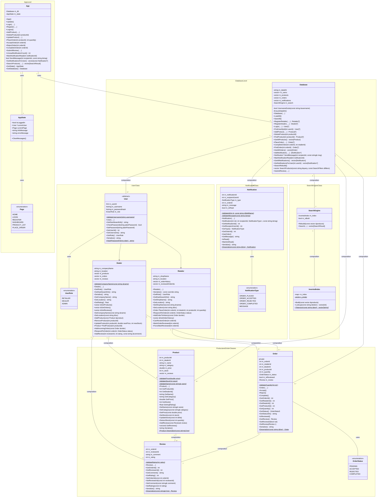

will fill up later
sorry for the inconvenience

```mermaid
    classDiagram
    
    namespace AppLevel {
        
        class Page {
            <<enumeration>>
            HOME
            LOGIN
            REGISTER
            DASHBOARD
            PRODUCT_LIST
            PLACE_ORDER
        }

        class AppState {   
            +bool isLoggedIn 
            +User *currentUser

            
            +Page currentPage
            
            +string infoMessage
            +string errorMessage

            +ClearMessages()
            
        }

        class App { 
            -Database m_db
            -AppState m_state
            
            +App()

            +Update()

            +Login(.....)
            +Register(.....)
            +Logout()

            +AddProduct(.....)
            +DeleteProduct(int productId)
            +UpdateProduct(.....)

            +PlaceOrder(int productId, int quantity)
            +AcceptOrder(int orderId)
            +RejectOrder(int orderId)
            +CompleteOrder(int orderId)
            +SubmitReview(.....)


            +UnreadNotificationCount() int 
            +MarkNotificationRead(int notificationId)
            bool SendMessage(int recipientId, const string &msg) 
            +GetNotificationsForUser() vector[const Notification*]
            

            +SearchProducts (.....) vector[SearchResult]

            +GetState() AppState
            +GetDatabase() Database
        }
    }

    namespace DatabaseLevel{
        class Database {
            
            -string m_dataDir
            -vector<unique_ptr<User>> m_users
            -vector<Product> m_products
            -vector<Order> m_orders
            -vector<Notification> m_notifications
            -SearchEngine m_search

            -bool UsernameExists(const string &username)
            -EnsureDataDir()

        
            +Database(....)
            
            +LoadAll()
            +SaveAll()

            +RegisterRetailer(.....) Retailer[*] 
            +RegisterDealer(.....) Dealer[*]
            +Login(.....) User[*]
            +FindUserById(int userId) User[*]

            
            +AddProduct(.....) Product[*] 
            +DeleteProduct(int productId)
            +FindProduct(int productId)  Product[*] 
            +GetAllProducts() vector[Product]
            
            +PlaceOrder(.....) Order[*]
            +CompleteOrder(int orderId, int retailerId)
            +FindOrder(int orderId) Order[*]
            +GetAllOrders() vector[Order]

            
            +AddNotification(.....) [Notification*]
            +Notification* SendMessage(int recipientId, const string& msg) 
            +MarkNotificationRead(int notificationId)
            +GetAllNotifications() vector[Notification]
            +GetNotificationsForUser(int userId) vector[Notification*]

            
            +SearchRebuild()
            +vector<SearchResult> SearchProducts(const string &query, const SearchFilters &filters)

        
            +SubmitReview(.....)
        }
    }

    
    namespace UserClass {
        class User {
            <<abstract>>
            #int m_userId
            #string m_username
            #string m_passwordHash
            #UserRole m_role

            -ValidateUsername(string username)$

            +User(.....)
            +GetDashboardInfo() string*
            +CheckPassword(string plainPassword) bool
            +SetPassword(string plainPassword)
            +GetUserId() int
            +GetUsername() string
            +GetRole() UserRole*
            +Serialize() string
            +HashPassword(string plain)$ string
        }

        class UserRole {
            <<enumeration>>
            RETAILER
            DEALER
            ADMIN
        }

        class Retailer{
        
            -string m_shopName
            -string m_location
            -vector<Order> m_orderHistory
            -vector<int> m_reviewedOrderIds

        
            +Retailer(.....)

            +Serialize() const override string

            +GetRole() UserRole 
            +GetDashboardInfo() string

            +GetShopName() string
            +GetLocation() string

            
            +SetShopName(const string &name)
            +SetLocation(const string &loc)

            +Order PlaceOrder(int orderId, int dealerId, int productId, int quantity)
            +RespondToOrder(int orderId, OrderStatus status)

            +AddOrderToHistory(const Order &order)
            +vector<Order> &GetOrderHistory()         

            +CanReviewOrder(int orderId)
            +MarkOrderReviewed(int orderId)
            +ForceMarkReviewed(int orderId) 
        }

        class Dealer {
            -string m_companyName
            -string m_location
            -vector<Product> m_products
            -vector<Order> m_orders
            -vector<Review> m_reviews

            -ValidateCompanyName(const string &name)$


            +Dealer(.....)

            
            +GetRole() UserRole 
            +GetDashboardInfo() string
            +Serialize() string

            
            +GetCompanyName() string
            +GetLocation() string
            +GetRating() float
            +vector<Product> &GetProducts() 
            +vector<Order> &GetOrders() 
            +vector<Review> &GetReviews() 

            
            +SetCompanyName(const string &name)
            +SetLocation(const string &loc)

            
            +AddProduct(const Product &product)
            +RemoveProduct(int productId)
            +UpdateProduct(int productId, double newPrice, int newStock)
            +Product *FindProduct(int productId)

            
            +AddIncomingOrder(const Order &order)
            +RespondToOrder(int orderId, OrderStatus status)

            
            +AddReview(int reviewerId, int rating, const string &comment)
        }
    }

    namespace ProductandOrder Classes {
        class Review {
        
            -int m_orderId
            -int m_reviewerId
            -string m_comment
            -int m_rating

            -ValidateRating(int rating)$
        
        
        
            +Review(.....)

            +GetOrderId() int 
            +GetReviewerId() int 
            +GetComment() string 
            +GetRating() int 

            +SetOrderId(const int orderId)
            +SetReviewerId(const int reviewerId)
            +SetComment(const string& comment)
            +SetRating(const int rating)

            +Serialize() string 
            +Deserialize(const string& line)$ Review 
        }

        class Product {

            -int m_productId
            -int m_dealerId
            -string m_name
            -string m_category
            -double m_price
            -int m_stock
            -vector<Review> m_reviews 


            -ValidatePrice(double price)$
            -ValidateStock(int stock)$
            -ValidateName(const string& name)$
        
            +Product(.....)
            

            +int GetProductId() 
            +int GetDealerId() 
            +string GetName() 
            +string GetCategory() 
            +double GetPrice() 
            +int GetStock() 
            +float GetAvgRating() 


            +SetName(const string& name)
            +SetCategory(const string& category)
            +SetPrice(const double price)
            +SetStock(const int stock)


            +UpdateStock(const int delta)
            +DeductStock(const int quantity)


            +AddReview(const Review& review)
            +vector<Review>& GetReviews() 

            +string Serialize()
            +Product Deserialize(const string& line)$
        }

        class OrderStatus {
            <<enumeration>>
            PENDING
            ACCEPTED
            REJECTED
            COMPLETED
        }

        class Order {
        private:
            -int m_orderId
            -int m_retailerId
            -int m_dealerId
            -int m_productId
            -int m_quantity
            -OrderStatus m_status
            -bool m_isReviewed
            -Review m_review

            -ValidateQuantity(int qty)$

            +Order(.....)

            +Accept()
            +Reject()
            +Complete()


            +GetOrderId() int
            +GetRetailerId() int
            +GetDealerId() int
            +GetProductId() int
            +GetQuantity() int 
            +GetStatus() OrderStatuS
            +GetStatusStr() string 
            +IsReviewed()
            +GetReview() Review 

            +SetReviewed(bool val) 
            +SetReview(Review r)

            +Serialize() string 
            +Deserialize(const string &line)$ Order
        }
    }

    namespace NotificationClass {
        class Notification {
        
            -int m_notificationId
            -int m_recipientUserId
            -NotificationType m_type
            -int m_orderId
            -string m_message
            -bool m_isRead

            -ValidateId(int id, const string &fieldName)$
            -ValidateMessage(const string &msg)$

            +Notification(.....)

            +Notification(int nid, int recipientId, NotificationType t, const string &msg)

            +GetNotificationId() int 
            +GetRecipientUserId() int 
            +GetType() NotificationType
            +GetOrderId() int 
            +HasOrder() 
            +GetMessage() string
            +IsRead() 

            +MarkAsRead()

            +Serialize() string
            +Deserialize(const string &line)$ Notification
        }

        class NotificationType {
            <<enumeration>>
            ORDER_PLACED
            ORDER_ACCEPTED
            ORDER_REJECTED
            ORDER_COMPLETED
            MESSAGE
        }
    }

    namespace SearchEngineClass {
        class SearchEngine {
            
            -InvertedIndex m_index
            -bool m_isBuilt
            
            +Rebuild(const vector<Product> &products)
            +Search(...) vector[SearchResult]
        }

        class InvertedIndex {

            -map<string, vector<int>> m_index
            -vector<int> s_empty$

            +Build(const vector<Product> &products)
            
            +Lookup(const string &token) vector[int]

            +Tokenize(const string &text)$ vector[string] 

        }
    }

    

    User -- UserRole : uses
    User --> Retailer
    User --> Dealer 
    Retailer "1"--"0..*" Order : composition
    Dealer "1"--"0..*" Order : composition
    Dealer "1"--"0..*" Product : composition
    Dealer "1"--"0..*" Review : composition
    Product "1"--"0..*" Review : composition
    Order "1"--"1" Review : composition
    Order -- OrderStatus : uses
    SearchEngine "1"--"1" InvertedIndex : composition
    Notification -- NotificationType : uses
    Database "1"--"0..*" User : composition
    Database "1"--"0..*" Product : composition
    Database "1"--"0..*" Order : composition
    Database "1"--"0..*" Notification : composition
    Database "1"--"1" SearchEngine : composition
    AppState -- Page : uses
    App "1"--"1" Database : uses
    App "1"--"1" AppState : uses

    
```
test commit 1 Mahir